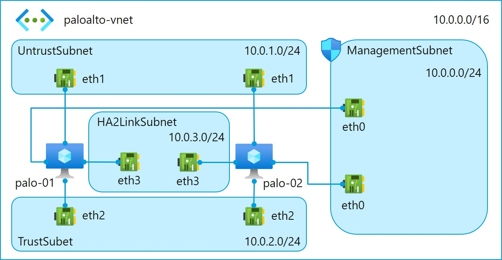
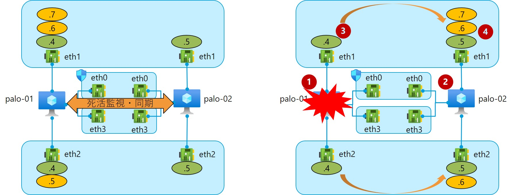

# Palo Alto Networks VM series HA 構成
## 概要
**Palo Alto Networks 社 VM series** （以下、**PA VM** とする）を Azure 上に構築する際の設計考慮事項をまとめる。
今回は主に HA 構成を想定した観点を含むため、リソース構成は次のようなイメージである。



## IaaS 設計
### VM サイズ設計
**Network Virtual Appliance (NVA)** 展開時の VM サイズの選択指標となるのは次の要素である。

- ライセンスモデル指標
- 最大 NIC 数

#### ライセンスモデル指標
VM サイズは採用するライセンスのグレードによってスペックを選定する。
参考となる指標はメーカーページを参考にする。

参考リンク：[VM-Series Models on Azure Virtual Machines (VMs)](https://docs.paloaltonetworks.com/vm-series/10-0/vm-series-performance-capacity/vm-series-performance-capacity/vm-series-on-azure-models-and-vms.html)

#### 最大 NIC 数
NVA 利用時は最大 NIC 数に注意する。
製品によって複数、特に3つ以上の NIC が必要となるため、下位サイズでは要件を満たせないことがある。

Palo Alto VM series では最低3つ、**Active-Passive 高可用性構成(HA 構成)** の場合は4つの NIC が必要となる。
汎用 VM サイズシリーズの場合、3つ以上の NIC を搭載できる最低サイズは次の通りである。
本番環境で採用できる中でも一番安価なのは `Standard_D3_v2` である。

- Standard_D3_v2
- Standard_D8_v3
- Standard_D8_v4
- Standard_D8d_v4
- Standard_D8a_v4
- Standard_E8_v3
- Standard_A4_v2

※S 付きのシリーズもサポート

参考：[汎用仮想マシンのサイズ](https://docs.microsoft.com/ja-jp/azure/virtual-machines/sizes-general)

### 可用性設計
Azure で提供される可用性機能は次の2つである。

- 可用性セット
- 可用性ゾーン

どちらを選ぶかは SLA 指標と製品のサポートによる。
メーカーにサポート可否や実績を確認してから選択する。

Active-Active 構成の場合は上流に Azure Load Balancer を配置することで負荷分散冗長構成が可能となる。
Active-Passive 構成の場合は上流に Azure Load Balancer を配置しない。
ゾーン間通信が冗長機能に影響及ぼす可能性もあるので確認する。
（ただし、後述の HA 切り替わり動作の仕様によりそこまで考慮する必要はないかもしれない）

### ライセンス設計
ライセンスは契約形態により次の3種類から選択できる。

- BYOL
- PAYG (Bundle 1)
- PAYG (Bundle 2)

BYOL の場合は別途代理店よりライセンス購入手続きが必要となる。
Bundle 1/2 の場合は従量課金でライセンス料金が発生する。
別途調整の手間を省けるが、利用する機能に合わせて料金の調整ができない。

PAYG 方式ライセンスに含まれる機能は次の通りである。

| プラン | 機能 |
| --- | --- |
| Bundle1 | 脅威保護（IDS/IPS、アンチウイルス、マルウェア保護）、プレミアサポート |
| Bundle2 | URL フィルタリング、WildFire、GlobalProtect、DNS セキュリティ、プレミアサポート | 

参考：[Azure Marketplace | VM-Series Next-Generation Firewall from Palo Alto Networks
](https://azuremarketplace.microsoft.com/ja/marketplace/apps/paloaltonetworks.vmseries-ngfw?tab=PlansAndPrice)

ライセンスプランの切替は可能だが、仮想マシン再作成が必要になるためデプロイ時は慎重にすること。

参考リンク：[Switch Between the BYOL and the PAYG Licenses](https://docs.paloaltonetworks.com/vm-series/7-1/vm-series-deployment/license-the-vm-series-firewall/switch-between-the-byol-and-the-payg-licenses)

### ネットワーク設計
NVA ではエンドツーエンドの通信を中継して何らかの処理をするため、NIC で次の設定を行う必要がある。
Palo Alto VM の場合は既定で有効となっている。

- IP 転送設定：有効

また、Active-Passive 構成の場合、クライアントが通信時に利用する仮想 IP アドレスを設定する必要がある。
Azure の機能では仮想 IP をサポートしていないため、アクティブなノードの NIC にセカンダリ IP としてアドレスを設定する。

また、各 NIC はそれぞれ次のように役割を定義する。

- eth0 : Management
- eth1 : Untrust
- eth2 : Trust
- eth3 : HA2 Link（Active-Passive 構成のみ）


#### Management
Management インターフェースは管理コンソールへのアクセスを提供する。
Active-Passive 構成時は、対向インスタンスと HA ピア間の制御通信（HA1 Link）も行う。

#### Trust / Untrust
アクティブインスタンスの Trust インターフェースおよび Untrust インターフェースにはサービストラフィックが流れる。
また、それぞれのインターフェースにはプライマリのプライベート IP アドレスの他にセカンダリ IP アドレスを付与する。
このセカンダリ IP アドレスは、アクティブインスタンスが利用不可能となったとき、自動的に新しくアクティブになったインスタンスへ付け替えられる。

#### HA2 Link
Active-Passive 構成を利用する場合にのみ使用する。
HA2 Link インターフェースは HA ピア間でセッションテーブル、ARP テーブル、IPsec セキュリティアソシエーションの同期を行うために利用する。


### 障害時の動作
Active-Passive 構成のとき、PAN-OS の高可用性機能により、インスタンス間で死活監視と通信情報の同期を実現する。
アクティブインスタンスに障害が発生した場合は、PAN-OS 上でのステータスの切り替えとAzure API を利用して仮想マシンのフローティングIPの付替えによるフェールオーバーを自動で行う。

#### 動作の流れ
フェールオーバーの動作は次の通りである。

1. アクティブインスタンスに障害が発生する。（この時点で通信断が発生）
2. スタンバイインスタンスが障害を検知し、アクティブインスタンスに昇格する。
3. Azure API 経由で、障害発生インスタンスの NIC に付与されているフローティング IP アドレスをデタッチする。
4. Azure API 経由で、デタッチしたフローティング IP アドレスを新しいアクティブインスタンスの NIC にアタッチする。
5. Azure 基盤側で新しいアクティブインスタンスに付与されたフローティング IP アドレスの情報が伝搬されると、通信が復旧する。



#### Azure サービスプリンシパル
PA VM が Azure リソースの構成を変更できるよう、適切な権限を持ったサービスプリンシパルを準備する。
HA 構成で必要な権限は次の通りである。

- Microsoft.Authorization/*/read
- Microsoft.Network/networkInterfaces/*
- Microsoft.Network/networkSecurityGroups/*
- Microsoft.Network/virtualNetworks/*
- Microsoft.Compute/virtualMachines/read

参考：[VM-Series on Azure Service Principal Permissions](https://docs.paloaltonetworks.com/vm-series/9-1/vm-series-deployment/set-up-the-vm-series-firewall-on-azure/about-the-vm-series-firewall-on-azure/vm-series-on-azure-service-principal-permissions.html#idd6bb5037-de5b-4769-aaa8-e2b08a103c5f)

## 運用設計
PA VM では Log Analytics エージェントがサポートされていない。
そのため、別の方法でメトリック監視やシステムログの監視を行う必要がある。

### メトリック監視
メトリック監視に使える Azure サービスもしくは機能として次のものがある。

- Azure Monitor
- Palo Alto API
- SNMP

#### Azure Monitor
Azure 標準のメトリック監視サービスである Azure Monitor を利用する。
主に監視する対象は次の通りである。

- CPU 使用率
- Network In
- Network Out
- 受信フロー数
- 送信フロー数

適宜アラートを設定し、通知を受けられるように設定する。
参考：[リモート作業でのネットワーク仮想アプライアンス (NVA) に関する考慮事項 - リソースの監視
](https://docs.microsoft.com/ja-jp/azure/vpn-gateway/nva-work-remotely-support#monitoring-resources)

#### Palo Alto API
API 経由で PA VM から各種メトリックを取得できる。
リファレンスは次の通りである。

[API Log Retrieval Parameters](https://docs.paloaltonetworks.com/pan-os/9-1/pan-os-panorama-api/pan-os-xml-api-request-types/retrieve-logs-api/api-log-retrieval-parameters.html)

[Run Operational Mode Commands (API)](https://docs.paloaltonetworks.com/pan-os/10-0/pan-os-panorama-api/pan-os-xml-api-request-types/run-operational-mode-commands-api.html)

[Use the API Browser](https://docs.paloaltonetworks.com/pan-os/8-1/pan-os-panorama-api/get-started-with-the-pan-os-xml-api/explore-the-api/use-the-api-browser.html#id676e85fa-1823-466a-9e31-269dc6eb433a)

### システムログ監視
システムログ監視に使える Azure サービスもしくは機能として次のものがある。

- Azure Sentinel
- Webhook
- Mail/Syslog

#### Azure Sentinel
Azure Sentinel を使用して次の流れで監視データを送信する。

```
[PA VM] --- [Log Forwawrder] --- [Log Analytics] --- [Azure Sentinel]
```

PA VM から直接 Log Analytics ワークスペースへログを送信できないため、プロキシとなる仮想マシンを用意する必要がある。
収集したデータは Log Analytics や Sentinel のブックで分析、監視する。

参考：[共通イベント形式を使用して外部ソリューションを接続する](https://docs.microsoft.com/ja-jp/azure/sentinel/connect-common-event-format)

参考：[ログ フォワーダーをデプロイする](https://docs.microsoft.com/ja-jp/azure/sentinel/connect-cef-agent?tabs=rsyslog)

参考：[Azure Sentinel に Palo Alto Networks を接続する](https://docs.microsoft.com/ja-jp/azure/sentinel/connect-paloalto)

#### Webhook

[PAN-OS Web Interface Reference - Device > Server Profiles > HTTP](https://docs.paloaltonetworks.com/pan-os/9-1/pan-os-web-interface-help/device/device-server-profiles-http.html)


### トラブルシュート
[データプレーンCPU負荷が高い時のトラブルシューティング](https://live.paloaltonetworks.com/t5/%E3%83%8A%E3%83%AC%E3%83%83%E3%82%B8%E3%83%89%E3%82%AD%E3%83%A5%E3%83%A1%E3%83%B3%E3%83%88/%E3%83%87%E3%83%BC%E3%82%BF%E3%83%97%E3%83%AC%E3%83%BC%E3%83%B3cpu%E8%B2%A0%E8%8D%B7%E3%81%8C%E9%AB%98%E3%81%84%E6%99%82%E3%81%AE%E3%83%88%E3%83%A9%E3%83%96%E3%83%AB%E3%82%B7%E3%83%A5%E3%83%BC%E3%83%86%E3%82%A3%E3%83%B3%E3%82%B0/ta-p/191260#)

show system resources
実行中のプロセスごとにシステムリソースの使用状況が確認できます。(topコマンドと同じです。)

show interface <インタフェース番号>
インタフェースの各種カウンタが確認できます。

show high-availability all
対象ホストの状況(Active or Passice)や、ピアの状況が確認できます。


## 構築
HA 構成の PA VM をデプロイする ARM テンプレートを作成した。

### Azure へデプロイ
[](https://portal.azure.com/#create/Microsoft.Template/uri/https%3A%2F%2Fraw.githubusercontent.com%2Fsny0421%2Fpaloalto-ha-arm-template%2Fmain%2Farm-template.json)


## その他参考リンク
[Set up Active/Passive HA on Azure](https://docs.paloaltonetworks.com/vm-series/9-1/vm-series-deployment/set-up-the-vm-series-firewall-on-azure/configure-activepassive-ha-for-vm-series-firewall-on-azure.html)

[PaloAlto on Azure を Active/Passive 構成で導入する](https://blog.aimless.jp/archives/2019/03/deploy-paloalto-on-azure-as-active-passive)
